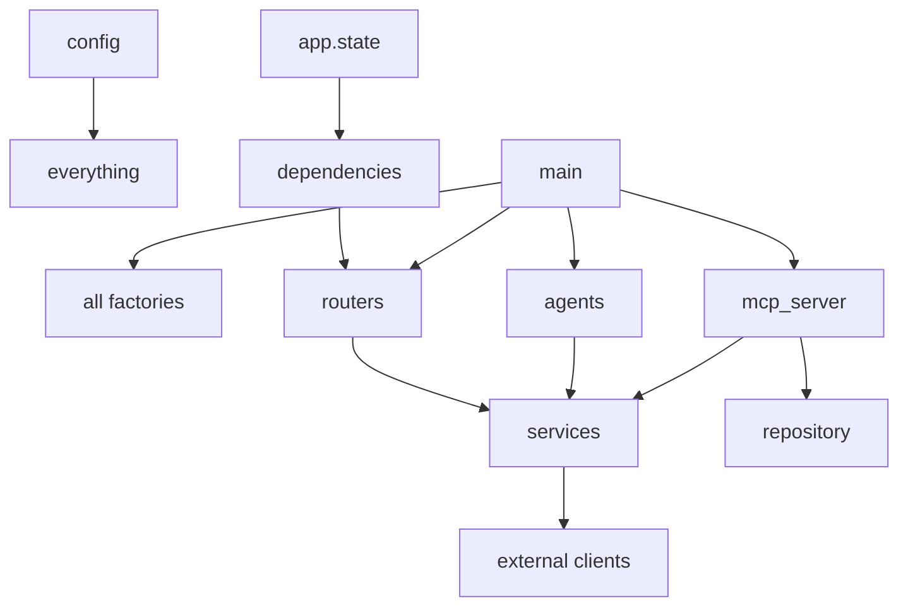
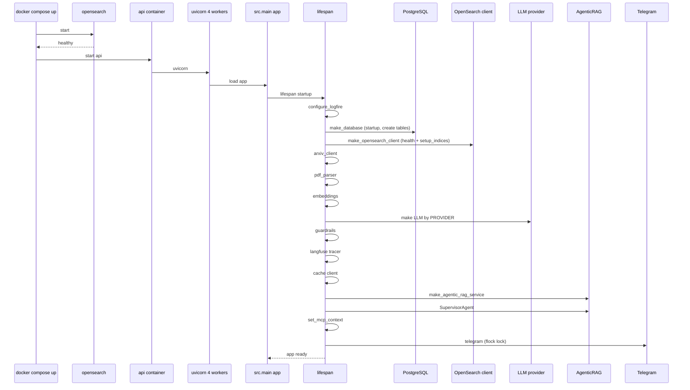
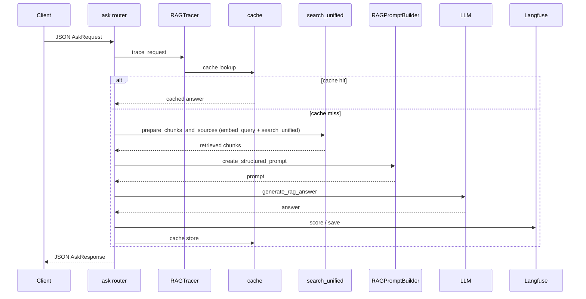
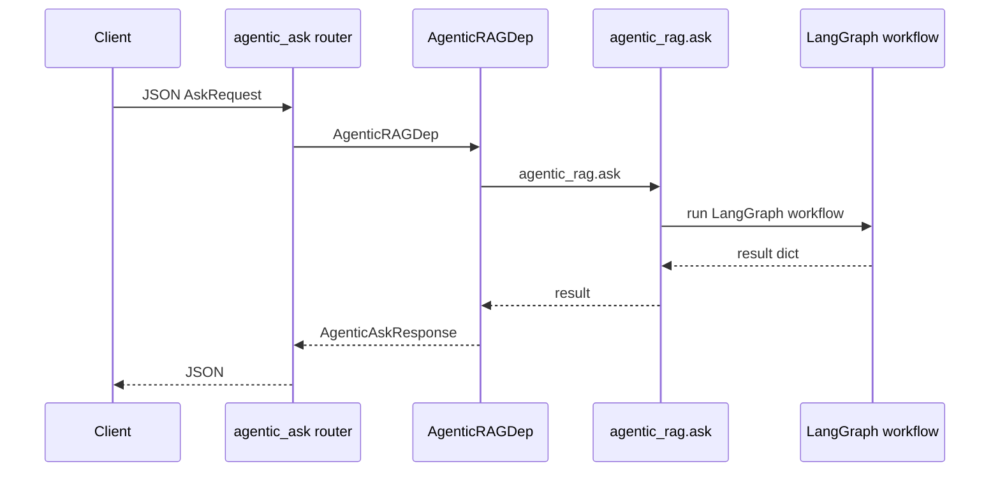
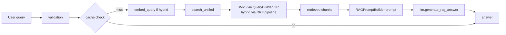
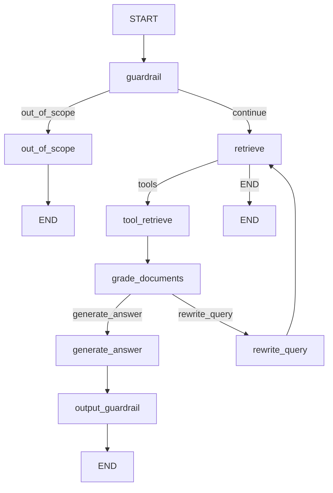
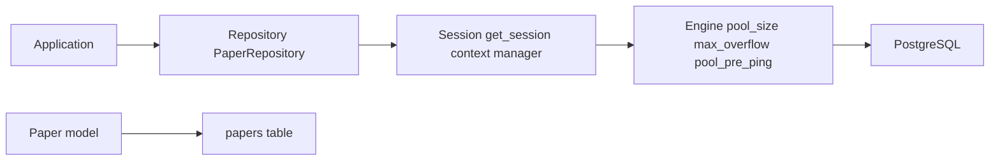
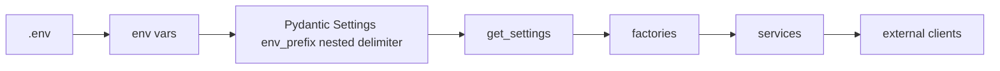
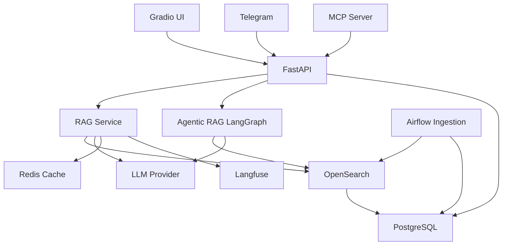

# COMPLETE FROM-SCRATCH BUILD MANUAL — PHASE 0: SYSTEM UNDERSTANDING

> **Purpose:** This document is the Phase 0 deliverable for the from-scratch reconstruction of the **arXiv Paper Curator** — an Agentic RAG system. It synthesizes all prior analysis into a single, complete build manual. It is a **documentation-only** artifact; it contains no application code and reveals no secret values.

---

## 01. Project Overview

The system is an **"arXiv Paper Curator"** — an Agentic RAG application that:

- **Ingests** arXiv research papers (metadata + PDF full text).
- **Chunks and embeds** them using Jina AI embeddings.
- **Indexes** them in OpenSearch using **hybrid search** (BM25 + vector KNN with Reciprocal Rank Fusion / RRF).
- **Answers** natural-language questions via two pipelines:
  1. A **standard RAG pipeline** (`/ask`).
  2. A **LangGraph-based agentic RAG pipeline** (`/ask-agentic`, `/ask-supervisor`).

It exposes multiple interfaces:

- **FastAPI REST API** (primary).
- **MCP server** (Model Context Protocol, mounted as a sub-app).
- **Gradio UI**.
- **Telegram bot** (optional).

Supporting infrastructure:

- **Airflow** for scheduled ingestion.
- **Redis** (Upstash) for exact-match caching.
- **Langfuse + Logfire** for observability.
- **OpenAI or AWS Bedrock** as the LLM provider (swappable via `PROVIDER`).

---

## 02. Requirements

| Category | Requirement |
|----------|-------------|
| Language | Python `>=3.12,<3.13` |
| Metadata DB | PostgreSQL (Neon) |
| Search | OpenSearch 2.x (BM25 + vector KNN with RRF) |
| Cache | Redis (Upstash) |
| Embeddings | Jina AI (`jina-embeddings-v3`, 1024-dim) |
| LLM Provider | OpenAI (`gpt-4o-mini`) **or** AWS Bedrock |
| Observability | Langfuse (tracing), Logfire (optional logging) |
| Orchestration | Airflow 2.10.3 |
| Bot | Telegram (optional) |
| Deployment | Docker / Docker Compose (local); AWS EKS (production) |

---

## 03. Architecture

**Actual architecture:** LAYERED ARCHITECTURE with **repository + factory + dependency-injection** patterns, leaning toward clean/hexagonal in places.

**Evidence:**

- **Layered separation:** `config → main (composition root) → DI → persistence (db/models/repositories) → services → routers`. Clear downward dependency direction.
- **Repository pattern:** `PaperRepository` abstracts data access; `BaseDatabase`/`BaseRepository` define contracts.
- **Factory pattern:** `make_*_client()` / `make_*_service()` centralize construction.
- **Dependency Injection:** FastAPI `Depends()`/`Annotated` aliases + `app.state` as a service container.
- **Hexagonal leanings:** `LLMClientProtocol` abstracts the LLM provider (OpenAI/Bedrock/Ollama swap via `PROVIDER`); `BaseDatabase` abstracts the persistence port.

**Inconsistencies / known issues:**

- `BaseRepository` is **not implemented** by `PaperRepository`.
- `src/database.py` and `src/middlewares.py` are **orphaned** (no importers / not wired).
- `PaperNotFound` / `PaperNotSaved` exceptions are **unused**.

---

## 04. Component Map

| Component | Location | Responsibility |
|-----------|----------|----------------|
| Configuration | [`src/config.py`](Agentic-RAG-project-agentops/src/config.py) | Pydantic Settings v2, env-prefixed |
| Application entry / composition root | [`src/main.py`](Agentic-RAG-project-agentops/src/main.py) | FastAPI app, lifespan, routers, MCP mount |
| DI | [`src/dependencies.py`](Agentic-RAG-project-agentops/src/dependencies.py) | `Depends` providers + `Annotated` aliases |
| Persistence | [`src/db/`](Agentic-RAG-project-agentops/src/db/), [`src/models/paper.py`](Agentic-RAG-project-agentops/src/models/paper.py), [`src/repositories/paper.py`](Agentic-RAG-project-agentops/src/repositories/paper.py) | Factory, interfaces/base, interfaces/postgresql, model, repository |
| Schemas | [`src/schemas/`](Agentic-RAG-project-agentops/src/schemas/) | api, arxiv, database, embeddings, indexing, pdf_parser, telegram, ollama |
| Services | [`src/services/`](Agentic-RAG-project-agentops/src/services/) | arxiv, pdf_parser, embeddings, opensearch, indexing, cache, openai_llm, bedrock_llm, bedrock_guardrails, ollama, langfuse, logfire, telegram, a2a, metadata_fetcher, llm_client_protocol |
| Agents | [`src/services/agents/`](Agentic-RAG-project-agentops/src/services/agents/) | agentic_rag, config, context, factory, models, prompts, state, summarizer_agent, supervisor_agent, tools, nodes/ |
| Routers | [`src/routers/`](Agentic-RAG-project-agentops/src/routers/) | ping, ask, hybrid_search, agentic_ask, supervisor_ask, a2a |
| MCP | [`src/mcp_server/`](Agentic-RAG-project-agentops/src/mcp_server/) | server, resources, tools |
| UI | [`src/gradio_app.py`](Agentic-RAG-project-agentops/src/gradio_app.py) | Gradio interface |
| Infra | `Dockerfile`, `compose.yml`, `entrypoint.sh`, `airflow/`, `deployment/`, `scripts/`, `workflows/`, `notebooks/` | Containerization, orchestration, deployment, scripts |

---

## 05. Directory Map

| Directory | Responsibility | Layer | Important Files | Dependencies |
|-----------|----------------|-------|-----------------|--------------|
| `src/` | Application source root | All | `main.py`, `config.py`, `dependencies.py`, `exceptions.py` | Everything |
| `src/config.py` | Settings (Pydantic v2) | Config | `Settings` classes | `pydantic-settings`, env |
| `src/main.py` | Composition root, FastAPI app | Entry | `app`, `lifespan` | All factories |
| `src/dependencies.py` | DI providers + aliases | DI | `Depends` providers | `app.state`, services |
| `src/db/` | Persistence layer | Persistence | `factory.py`, `interfaces/base.py`, `interfaces/postgresql.py` | SQLAlchemy, config |
| `src/models/` | ORM models | Domain | `paper.py` | SQLAlchemy |
| `src/repositories/` | Data access | Persistence | `paper.py` | db, models |
| `src/schemas/` | Pydantic schemas | Domain | api/, arxiv/, database/, embeddings/, indexing/, pdf_parser/, telegram/, ollama/ | Pydantic |
| `src/services/` | Business logic + external clients | Service | arxiv/, pdf_parser/, embeddings/, opensearch/, indexing/, cache/, openai_llm/, bedrock_llm/, ollama/, langfuse/, logfire/, telegram/, a2a/ | External clients |
| `src/services/agents/` | LangGraph agent workflow | Service | agentic_rag.py, state.py, nodes/, tools.py, supervisor_agent.py, summarizer_agent.py | LangGraph, services |
| `src/routers/` | HTTP endpoints | Interface | ping.py, ask.py, hybrid_search.py, agentic_ask.py, supervisor_ask.py, a2a.py | dependencies, services |
| `src/mcp_server/` | MCP protocol server | Interface | server.py, resources, tools | services, repository |
| `tests/` | Test suite | Test | api/, unit/, integration/, eval/ | pytest |
| `airflow/` | Airflow DAGs + config | Orchestration | DAG files, entrypoint | Airflow |
| `deployment/` | K8s manifests | Deploy | api, airflow, opensearch, dashboards, secrets | Kubernetes |
| `scripts/` | Utility scripts | Tooling | insert_papers_by_id.py, load_test.py, test_connections.py | App |
| `notebooks/` | Phase notebooks | Docs | phase2..phase7 | Jupyter |
| `workflows/` | Phase + K8s docs | Docs | phase*.md, kubernetes/ | — |
| `static/` | Diagrams | Docs | langgraph-mermaid, phase diagrams | — |
| `data/` | Runtime data | Data | (downloaded PDFs, caches) | — |

---

## 06. File Inventory

Summarized by category with usage classification.

### Configuration & Entry
| File | Usage |
|------|-------|
| `src/config.py` | **Active** — Pydantic Settings |
| `src/main.py` | **Active** — composition root |
| `src/dependencies.py` | **Active** — DI |
| `src/exceptions.py` | **Active** — exception hierarchy |

### Persistence
| File | Usage |
|------|-------|
| `src/db/factory.py` | **Active** |
| `src/db/interfaces/base.py` | **Active** (contract) |
| `src/db/interfaces/postgresql.py` | **Active** |
| `src/models/paper.py` | **Active** |
| `src/repositories/paper.py` | **Active** |

### Schemas
| File | Usage |
|------|-------|
| `src/schemas/api/*` | **Active** (ask, health, search) |
| `src/schemas/arxiv/paper.py` | **Active** |
| `src/schemas/database/config.py` | **Active** |
| `src/schemas/embeddings/jina.py` | **Active** |
| `src/schemas/indexing/models.py` | **Active** |
| `src/schemas/pdf_parser/models.py` | **Active** |
| `src/schemas/telegram/*` | **Active** |
| `src/schemas/ollama.py` | **Active** |
| `src/schemas/common/__init__.py` | **DEAD** — broken import to non-existent `src.schemas.search` |

### Services
| File | Usage |
|------|-------|
| `src/services/arxiv/*` | **Active** |
| `src/services/pdf_parser/*` | **Active** |
| `src/services/embeddings/*` | **Active** |
| `src/services/opensearch/*` | **Active** |
| `src/services/indexing/*` | **Active** |
| `src/services/cache/*` | **Active** |
| `src/services/openai_llm/*` | **Active** |
| `src/services/bedrock_llm/*` | **Active** (conditional) |
| `src/services/bedrock_guardrails/*` | **Active** (conditional) |
| `src/services/ollama/*` | **INDIRECTLY USED** — implements protocol but not wired into `PROVIDER` selection |
| `src/services/langfuse/*` | **Active** |
| `src/services/logfire/*` | **Active** (optional) |
| `src/services/telegram/*` | **Active** (optional) |
| `src/services/a2a/*` | **Active** |
| `src/services/metadata_fetcher.py` | **Active** |
| `src/services/llm_client_protocol.py` | **Active** (contract) |

### Agents
| File | Usage |
|------|-------|
| `src/services/agents/agentic_rag.py` | **Active** |
| `src/services/agents/state.py` | **Active** |
| `src/services/agents/models.py` | **Active** |
| `src/services/agents/context.py` | **Active** |
| `src/services/agents/factory.py` | **Active** |
| `src/services/agents/config.py` | **Active** |
| `src/services/agents/tools.py` | **Active** |
| `src/services/agents/supervisor_agent.py` | **Active** |
| `src/services/agents/summarizer_agent.py` | **Active** |
| `src/services/agents/nodes/*` | **Active** (8 nodes) |
| `src/services/agents/prompts.py` | **Partially DEAD** — `SYSTEM_MESSAGE`, `DECISION_PROMPT`, `DIRECT_RESPONSE_PROMPT`, `GUARDRAIL_PROMPT` unused |

### Routers
| File | Usage |
|------|-------|
| `src/routers/ping.py` | **Active** |
| `src/routers/ask.py` | **Active** |
| `src/routers/hybrid_search.py` | **Active** |
| `src/routers/agentic_ask.py` | **Active** |
| `src/routers/supervisor_ask.py` | **Active** |
| `src/routers/a2a.py` | **Active** |
| `src/routers/__init__.py` | **DEAD** — stale re-export |

### MCP / UI
| File | Usage |
|------|-------|
| `src/mcp_server/*` | **Active** |
| `src/gradio_app.py` | **Active** |

### Dead / Orphaned
| File | Finding |
|------|---------|
| `src/database.py` | **DEAD** — no importers |
| `src/middlewares.py` | **DEAD** — documented as not wired |
| `src/schemas/common/__init__.py` | **DEAD** — broken import |
| `BaseRepository` | **DEAD** — no concrete subclass |
| `PaperNotFound` / `PaperNotSaved` | **DEAD** — unused |
| `SearchRequest` schema | **DEAD** — unused by routers |
| `src/routers/__init__.py` | **DEAD** — stale re-export |
| Vestigial state fields | **DEAD** — `sources`, `relevant_tool_artefacts`, `metadata` |

---

## 07. Dependency Graph

**Key relationships:**
- `config ← everything` (all layers read settings).
- `main → all factories` (composition root wires everything).
- `dependencies → app.state` (DI reads the service container).
- `routers → dependencies + services`.
- `services → external clients` (OpenSearch, Redis, Jina, LLM, Langfuse).
- `agents → services` (retrieval, LLM, guardrails).
- `mcp_server → services + repository`.

---

## 08. Startup Flow

**Shutdown:** stop telegram → release lock → `database.teardown`.

---

## 09. API Flow

Complete API route table:

| Method | Path | Router | Function | Request Schema | Response Schema | Purpose |
|--------|------|--------|----------|----------------|-----------------|---------|
| GET | `/api/v1/health` | `ping` | `health_check` | — | `HealthResponse` | Health check |
| POST | `/api/v1/ask` | `ask` | `ask_question` | `AskRequest` | `AskResponse` | Standard RAG answer |
| POST | `/api/v1/stream` | `ask` | `ask_question_stream` | `AskRequest` | SSE | Streaming RAG answer |
| POST | `/api/v1/hybrid-search/` | `hybrid_search` | `hybrid_search` | `SearchRequest` | `SearchResponse` | Hybrid search |
| POST | `/api/v1/ask-agentic` | `agentic_ask` | `ask_agentic` | `AskRequest` | `AgenticAskResponse` | Agentic RAG answer |
| POST | `/api/v1/feedback` | `agentic_ask` | `submit_feedback` | `FeedbackRequest` | `FeedbackResponse` | Feedback on answer |
| POST | `/api/v1/ask-supervisor` | `supervisor_ask` | `ask_supervisor` | `AskRequest` | `dict` | Supervisor-routed answer |
| GET | `/.well-known/agent.json` | `a2a` | `get_agent_card` | — | `AgentCard` | A2A agent card |
| POST | `/a2a/tasks/send` | `a2a` | `send_task` | `Task` | `Task` | A2A task dispatch |
| — | `/mcp` | mounted | FastMCP sub-app | — | — | MCP protocol server |

---

## 10. Data Flow

### `/ask` (standard RAG)

### `/ask-agentic` (agentic RAG)

---

## 11. Ingestion Flow

```mermaid
flowchart LR
    A[arXiv API] --> B[ArxivClient.fetch_papers]
    B --> C[rate-limited retry]
    C --> D[download_pdf cached]
    D --> E[DoclingParser.parse_pdf]
    E --> F[validate extract sections]
    F --> G[TextChunker.chunk_paper]
    G --> H[600w 100 overlap section-based]
    H --> I[JinaEmbeddingsClient.embed_passages]
    I --> J[1024-dim]
    J --> K[OpenSearchClient.bulk_index_chunks]
    K --> L[PostgreSQL PaperRepository.upsert]
```

**Triggered by:** Airflow DAG (daily 6am Mon–Fri) **or** `insert_papers_by_id.py`.

---

## 12. RAG Flow

**Technologies:** Jina embeddings, OpenSearch (BM25 + KNN + RRF), OpenAI/Bedrock LLM.

---

## 13. Agent Flow

### LangGraph State (`AgentState` fields)

The state carries: the user query, retrieved documents, the generated answer, retrieval attempt count, guardrail decisions, tool artefacts, and routing metadata (including vestigial fields `sources`, `relevant_tool_artefacts`, `metadata`).

### The 8 Nodes

1. **guardrail** — input safety check.
2. **out_of_scope** — handle out-of-scope queries.
3. **retrieve** — retrieve documents (via tools or direct).
4. **tool_retrieve** — tool-based retrieval.
5. **grade_documents** — grade relevance of retrieved docs.
6. **rewrite_query** — rewrite the query for better retrieval.
7. **generate_answer** — generate the final answer.
8. **output_guardrail** — output safety check.

### Edges & Conditional Edges

- `guardrail → continue / out_of_scope` (conditional).
- `retrieve → tools / END` (conditional).
- `grade_documents → generate_answer / rewrite_query` (conditional).
- Retrieval loop up to `max_retrieval_attempts = 2`.

### Graph Diagram

### SupervisorAgent & SummarizerAgent

- **SupervisorAgent:** intent classification → routes to `rag_lookup` **or** `summarize`.
- **SummarizerAgent:** produces summaries (used for summarization intents).

---

## 14. Database Flow

- **ORM:** SQLAlchemy.
- **Tables:** auto-created via `Base.metadata.create_all` at startup.
- **Transactions:** per-method commits, rollback on error.

---

## 15. Configuration Flow

### Key Environment Variable NAMES (purposes only — never secrets)

| Env Var Name | Purpose |
|--------------|---------|
| `PROVIDER` | Selects LLM provider (`openai` / `bedrock` / `ollama`) |
| `OPENAI_API_KEY` | OpenAI authentication |
| `OPENAI_MODEL` | OpenAI model name (e.g. `gpt-4o-mini`) |
| `AWS_*` | AWS credentials / region for Bedrock |
| `BEDROCK_MODEL_ID` | Bedrock model identifier |
| `NEON_DATABASE_URL` / `DATABASE_URL` | PostgreSQL connection string |
| `OPENSEARCH_HOST` / `OPENSEARCH_PORT` | OpenSearch endpoint |
| `REDIS_URL` | Redis (Upstash) connection |
| `JINA_API_KEY` | Jina embeddings authentication |
| `JINA_EMBEDDING_MODEL` | Embedding model name |
| `LANGFUSE_*` | Langfuse project keys / host |
| `LOGFIRE_TOKEN` | Logfire token |
| `TELEGRAM_BOT_TOKEN` | Telegram bot token |
| `AIRFLOW_*` | Airflow configuration |

---

## 16. Error Flow

**Central exception hierarchy** in [`src/exceptions.py`](Agentic-RAG-project-agentops/src/exceptions.py):

- `Repository`
- `Parsing`
- `PDF`
- `OpenSearch`
- `Arxiv`
- `Metadata`
- `LLM` / `Ollama` / `OpenAI` / `Bedrock`
- `Configuration`

**Patterns:**

- Services **raise**; routers **catch** → `HTTPException`.
- **Fail-open patterns:**
  - Cache → returns `None` on miss/error.
  - Guardrails → score `100` on no service/error.
  - Output guardrail → pass-through on error.
  - Telegram → non-fatal.
- **Retry:**
  - arXiv download → exponential backoff.
  - Redis → `retry_on_timeout`.

---

## 17. Docker Architecture

- **Dockerfile:** 2-stage `uv` build, CPU torch, system deps for Docling.
- **compose.yml:** 4 services on `rag-network`:
  - `api:8000`
  - `opensearch:9200/9600`
  - `dashboards:5601`
  - `airflow:8080`
- **Volumes:** `opensearch_data`, `airflow_logs`.
- **Health checks** + `depends_on` gating.
- **env_file:** `.env`.

---

## 18. Airflow Architecture

### `arxiv_paper_ingestion` DAG

- **Schedule:** `0 6 * * 1-5` (daily 6am Mon–Fri).
- **Retries:** 2, **retry_delay:** 30 min.
- **Tasks:**
  1. `setup_environment`
  2. `fetch_daily_papers`
  3. `index_papers_hybrid`
  4. `generate_daily_report`
  5. `cleanup_temp_files`
- Uses **XCom** for inter-task data.

### `hello_world_dag`

Smoke test DAG.

### Airflow Container

`entrypoint.sh`: db migrate → sync-perm → create admin → webserver + scheduler.

---

## 19. CI/CD Architecture

- **GitHub Actions:**
  - `ci.yml` (PRs): lint, test, eval gate.
  - `cd.yml` (push to deployment branch): build-and-push to ECR → deploy to EKS.
- **EKS cluster:** `eksctl`, `m5.xlarge` nodes.
- **K8s manifests:** api deployment/hpa/service, airflow, opensearch statefulset, dashboards, secrets.
- **IRSA** for Bedrock.
- **Grafana Cloud** monitoring.

---

## 20. Testing Architecture

| Category | Scope | Files |
|----------|-------|-------|
| Unit | config, search schemas, arxiv, metadata_fetcher, query_builder, pdf_parser, telegram, agent models/tools/nodes/agentic_rag | `tests/unit/**` |
| API | ping, ask, hybrid_search, agentic_ask | `tests/api/routers/**` |
| Integration | live services | `tests/integration/test_services.py` |
| Evaluation | structural integrity gate | `tests/eval/test_golden_dataset.py` |

**Fixtures:**
- `tests/api/conftest.py` — full ASGI app with factory-level patching.
- `tests/unit/services/agents/conftest.py` — real `Context` with mocked collaborators.

**pytest config:** `asyncio_mode = auto`, `env_files = .env.test`.

**Coverage gaps (no direct tests):** cache, embeddings, indexing/chunking, LLM providers, observability, MCP, DB layer.

---

## 21. Build Order

The dependency-ordered build sequence (PHASE 0 through PHASE 16):

| Phase | Focus |
|-------|-------|
| PHASE 0 | System understanding (this document) |
| PHASE 1 | Project foundation |
| PHASE 2 | Configuration |
| PHASE 3 | Domain models & schemas |
| PHASE 4 | Exceptions |
| PHASE 5 | Database infrastructure |
| PHASE 6 | Repositories |
| PHASE 7 | External integrations |
| PHASE 8 | OpenSearch + query builder + index config |
| PHASE 9 | Indexing |
| PHASE 10 | LLM clients + guardrails |
| PHASE 11 | Observability + cache |
| PHASE 12 | RAG service |
| PHASE 13 | Agent workflow |
| PHASE 14 | FastAPI app |
| PHASE 15 | Background processing |
| PHASE 16 | Docker |
| PHASE 17 | Testing |
| PHASE 18 | CI/CD + deployment |
| PHASE 19 | Production readiness |

---

## 22. Step-by-Step Implementation Plan

> Each step follows the format: **STEP NUMBER, OBJECTIVE, WHY NOW, PREREQUISITES, CREATE, IMPLEMENT, EXPLANATION, DEPENDENCIES, CONNECTION, TEST, EXPECTED RESULT, FAILURE CASES, VERIFICATION CHECKLIST, WHAT I LEARNED, WHAT THIS UNLOCKS.**

---

### PHASE 0 — System Understanding

**STEP NUMBER:** 0.1
**OBJECTIVE:** Produce this complete from-scratch build manual.
**WHY NOW:** A full understanding of the target system is the prerequisite for every subsequent phase.
**PREREQUISITES:** None.
**CREATE:** `PHASE0_RECONSTRUCTION_MANUAL.md`.
**IMPLEMENT:** Document all 30 sections (architecture, components, flows, build order, verification, troubleshooting).
**EXPLANATION:** Phase 0 is documentation-only; it captures the complete blueprint.
**DEPENDENCIES:** None.
**CONNECTION:** Feeds every later phase with the authoritative reference.
**TEST:** Review for completeness against the 30-section checklist.
**EXPECTED RESULT:** A comprehensive, self-contained build manual.
**FAILURE CASES:** Missing sections, inaccurate flow descriptions.
**VERIFICATION CHECKLIST:** All 30 sections present; no secrets revealed; no code written.
**WHAT I LEARNED:** The full system topology and build sequence.
**WHAT THIS UNLOCKS:** PHASE 1.

---

### PHASE 1 — Project Foundation

**STEP NUMBER:** 1.1
**OBJECTIVE:** Create the empty project skeleton.
**WHY NOW:** Everything depends on a valid, installable project structure.
**PREREQUISITES:** PHASE 0.
**CREATE:** empty project dir, `pyproject.toml`, `.env.example`, `.gitignore`, `Makefile`.
**IMPLEMENT:** Configure `uv` as the package manager; declare Python `>=3.12,<3.13`; list core dependencies.
**EXPLANATION:** A clean foundation with pinned tooling avoids later dependency drift.
**DEPENDENCIES:** None (external tooling only).
**CONNECTION:** All later phases add code into this skeleton.
**TEST:** `uv sync` succeeds; `uv run python -c "import sys; print(sys.version)"`.
**EXPECTED RESULT:** Installable, versioned project.
**FAILURE CASES:** Python version mismatch, uv not installed.
**VERIFICATION CHECKLIST:** `pyproject.toml` valid; `.env.example` has var NAMES only; `.gitignore` covers caches/secrets.
**WHAT I LEARNED:** The toolchain baseline.
**WHAT THIS UNLOCKS:** PHASE 2.

---

### PHASE 2 — Configuration

**STEP NUMBER:** 2.1
**OBJECTIVE:** Implement Pydantic Settings v2 configuration.
**WHY NOW:** All services read settings; config must exist first.
**PREREQUISITES:** PHASE 1.
**CREATE:** `src/config.py`.
**IMPLEMENT:** `Settings` classes with `env_prefix`, nested delimiter; `get_settings()`.
**EXPLANATION:** Centralized, validated config with env-var override.
**DEPENDENCIES:** `pydantic-settings`.
**CONNECTION:** Every factory consumes these settings.
**TEST:** `tests/unit/test_config.py`.
**EXPECTED RESULT:** Settings load from `.env`; validation errors surface clearly.
**FAILURE CASES:** Missing required vars, wrong types.
**VERIFICATION CHECKLIST:** All env var NAMES documented; no secrets committed.
**WHAT I LEARNED:** The full set of configuration knobs.
**WHAT THIS UNLOCKS:** PHASE 3.

---

### PHASE 3 — Domain Models & Schemas

**STEP NUMBER:** 3.1
**OBJECTIVE:** Define ORM model and Pydantic schemas.
**WHY NOW:** Domain contracts are needed by persistence, services, and routers.
**PREREQUISITES:** PHASE 2.
**CREATE:** `src/models/paper.py`, `src/schemas/*`.
**IMPLEMENT:** `Paper` model; api/arxiv/database/embeddings/indexing/pdf_parser/telegram/ollama schemas.
**EXPLANATION:** Schemas define the API and internal data contracts.
**DEPENDENCIES:** Pydantic, SQLAlchemy.
**CONNECTION:** Repositories and routers use these types.
**TEST:** `tests/unit/schemas/test_search.py`.
**EXPECTED RESULT:** All schemas validate correctly.
**FAILURE CASES:** Broken imports (e.g., `src.schemas.common` referencing non-existent `search`).
**VERIFICATION CHECKLIST:** No broken imports; schemas match API table.
**WHAT I LEARNED:** The data shapes flowing through the system.
**WHAT THIS UNLOCKS:** PHASE 4.

---

### PHASE 4 — Exceptions

**STEP NUMBER:** 4.1
**OBJECTIVE:** Implement the central exception hierarchy.
**WHY NOW:** Services need typed exceptions before business logic.
**PREREQUISITES:** PHASE 3.
**CREATE:** `src/exceptions.py`.
**IMPLEMENT:** `Repository`, `Parsing`, `PDF`, `OpenSearch`, `Arxiv`, `Metadata`, `LLM`/`Ollama`/`OpenAI`/`Bedrock`, `Configuration`.
**EXPLANATION:** Typed exceptions enable clean error mapping to HTTP.
**DEPENDENCIES:** None.
**CONNECTION:** Routers map these exceptions to `HTTPException`.
**TEST:** Import and raise each exception type.
**EXPECTED RESULT:** All exception types import and raise cleanly.
**FAILURE CASES:** Circular imports with services.
**VERIFICATION CHECKLIST:** Hierarchy matches Section 16; no secrets.
**WHAT I LEARNED:** The error taxonomy of the system.
**WHAT THIS UNLOCKS:** PHASE 5.

---

### PHASE 5 — Database Infrastructure

**STEP NUMBER:** 5.1
**OBJECTIVE:** Implement the database layer (factory, interfaces, PostgreSQL).
**WHY NOW:** Persistence is required before repositories can be built.
**PREREQUISITES:** PHASE 4.
**CREATE:** `src/db/` (`__init__.py`, `factory.py`, `interfaces/base.py`, `interfaces/postgresql.py`).
**IMPLEMENT:** `BaseDatabase` contract, `PostgreSQLDatabase`, `make_database()` factory; startup + `create_all`; `teardown`.
**EXPLANATION:** Abstracts the persistence port behind a contract (hexagonal lean).
**DEPENDENCIES:** SQLAlchemy, config.
**CONNECTION:** Repositories consume this database object.
**TEST:** Startup creates tables; teardown closes engine.
**EXPECTED RESULT:** PostgreSQL connects, tables auto-created.
**FAILURE CASES:** Neon IPv6 issue (apply `hostaddr` fix), connection refused.
**VERIFICATION CHECKLIST:** Engine pool settings (`pool_size`, `max_overflow`, `pool_pre_ping`) correct.
**WHAT I LEARNED:** The persistence port contract.
**WHAT THIS UNLOCKS:** PHASE 6.

---

### PHASE 6 — Repositories

**STEP NUMBER:** 6.1
**OBJECTIVE:** Implement `PaperRepository`.
**WHY NOW:** Data access is needed by ingestion and RAG services.
**PREREQUISITES:** PHASE 5.
**CREATE:** `src/repositories/paper.py`.
**IMPLEMENT:** `PaperRepository` with `upsert`, query, and retrieval methods; per-method commits, rollback on error.
**EXPLANATION:** Centralizes all paper data access.
**DEPENDENCIES:** db, models.
**CONNECTION:** Used by indexing and metadata services.
**TEST:** Unit tests with mocked session.
**EXPECTED RESULT:** CRUD operations work against PostgreSQL.
**FAILURE CASES:** Transaction rollback on error.
**VERIFICATION CHECKLIST:** `BaseRepository` contract noted (not implemented in original — decide whether to align).
**WHAT I LEARNED:** The repository data-access patterns.
**WHAT THIS UNLOCKS:** PHASE 7.

---

### PHASE 7 — External Integrations

**STEP NUMBER:** 7.1
**OBJECTIVE:** Implement arxiv client, pdf_parser (Docling), and embeddings (Jina).
**WHY NOW:** These are the ingestion primitives.
**PREREQUISITES:** PHASE 6.
**CREATE:** `src/services/arxiv/`, `src/services/pdf_parser/`, `src/services/embeddings/`.
**IMPLEMENT:** `ArxivClient.fetch_papers` (rate-limited, retry, exponential backoff), `download_pdf` (cached), `DoclingParser.parse_pdf` (validate, extract sections), `JinaEmbeddingsClient.embed_passages` (1024-dim).
**EXPLANATION:** Each external integration is isolated behind a factory.
**DEPENDENCIES:** config, schemas, exceptions.
**CONNECTION:** Feeds the indexing pipeline.
**TEST:** `tests/unit/services/test_arxiv_client.py`, `test_pdf_parser.py`.
**EXPECTED RESULT:** Papers fetched, PDFs parsed, passages embedded.
**FAILURE CASES:** Docling system deps missing; arXiv rate limits.
**VERIFICATION CHECKLIST:** Retry/backoff present; caching on download.
**WHAT I LEARNED:** The ingestion primitives.
**WHAT THIS UNLOCKS:** PHASE 8.

---

### PHASE 8 — OpenSearch + Query Builder + Index Config

**STEP NUMBER:** 8.1
**OBJECTIVE:** Implement OpenSearch client, query builder, and hybrid index config.
**WHY NOW:** Vector store is core to RAG retrieval.
**PREREQUISITES:** PHASE 7.
**CREATE:** `src/services/opensearch/` (`client.py`, `factory.py`, `query_builder.py`, `index_config_hybrid.py`).
**IMPLEMENT:** `OpenSearchClient` (health, `setup_indices`, `bulk_index_chunks`, `search_unified`), `QueryBuilder` (BM25), hybrid index config (KNN + RRF).
**EXPLANATION:** Encapsulates all OpenSearch interaction.
**DEPENDENCIES:** config, schemas, exceptions.
**CONNECTION:** Used by indexing and RAG services.
**TEST:** `tests/unit/services/test_opensearch_query_builder.py`.
**EXPECTED RESULT:** Indices created; hybrid search returns ranked results.
**FAILURE CASES:** OpenSearch not healthy; index mapping mismatch.
**VERIFICATION CHECKLIST:** Health check + `setup_indices` at startup.
**WHAT I LEARNED:** The hybrid search mechanics (BM25 + KNN + RRF).
**WHAT THIS UNLOCKS:** PHASE 9.

---

### PHASE 9 — Indexing

**STEP NUMBER:** 9.1
**OBJECTIVE:** Implement text chunking and hybrid indexing.
**WHY NOW:** Converts parsed papers into indexed, searchable chunks.
**PREREQUISITES:** PHASE 8.
**CREATE:** `src/services/indexing/` (`text_chunker.py`, `hybrid_indexer.py`, `factory.py`).
**IMPLEMENT:** `TextChunker.chunk_paper` (600w / 100 overlap, section-based), `HybridIndexer` (embed + bulk index + upsert to PostgreSQL).
**EXPLANATION:** The bridge between parsing and the vector store.
**DEPENDENCIES:** embeddings, opensearch, repository.
**CONNECTION:** Invoked by Airflow DAG and `insert_papers_by_id.py`.
**TEST:** Manual smoke test against live OpenSearch.
**EXPECTED RESULT:** Papers chunked, embedded, indexed, and upserted.
**FAILURE CASES:** Chunk size/overlap misconfig; bulk index failures.
**VERIFICATION CHECKLIST:** Chunk params match spec; both stores updated.
**WHAT I LEARNED:** The end-to-end ingestion path.
**WHAT THIS UNLOCKS:** PHASE 10.

---

### PHASE 10 — LLM Clients + Guardrails

**STEP NUMBER:** 10.1
**OBJECTIVE:** Implement the LLM client protocol and providers + guardrails.
**WHY NOW:** LLM generation is required for RAG answers.
**PREREQUISITES:** PHASE 9.
**CREATE:** `src/services/llm_client_protocol.py`, `src/services/openai_llm/`, `src/services/bedrock_llm/`, `src/services/ollama/`, `src/services/bedrock_guardrails/`.
**IMPLEMENT:** `LLMClientProtocol`; `OpenAILLMClient` (`gpt-4o-mini`), `BedrockLLMClient`, `OllamaClient`; guardrails service (fail-open score 100).
**EXPLANATION:** The protocol enables provider swap via `PROVIDER`.
**DEPENDENCIES:** config, schemas, exceptions.
**CONNECTION:** Used by RAG and agent services.
**TEST:** Unit tests for protocol conformance.
**EXPECTED RESULT:** Provider selected by `PROVIDER`; answers generated.
**FAILURE CASES:** Missing API keys; Bedrock not configured.
**VERIFICATION CHECKLIST:** Ollama implements protocol (note: not wired into `PROVIDER` in original — decide whether to wire).
**WHAT I LEARNED:** The LLM abstraction layer.
**WHAT THIS UNLOCKS:** PHASE 11.

---

### PHASE 11 — Observability + Cache

**STEP NUMBER:** 11.1
**OBJECTIVE:** Implement Langfuse, Logfire, and Redis cache.
**WHY NOW:** Tracing and caching are cross-cutting needs.
**PREREQUISITES:** PHASE 10.
**CREATE:** `src/services/langfuse/`, `src/services/logfire/`, `src/services/cache/`.
**IMPLEMENT:** `RAGTracer` (trace_request, score/save), Logfire factory, `CacheClient` (exact-match, fail-open `None` on miss/error, `retry_on_timeout`).
**EXPLANATION:** Observability and caching wrap the RAG path.
**DEPENDENCIES:** config, schemas.
**CONNECTION:** Used by the RAG service.
**TEST:** Manual smoke test.
**EXPECTED RESULT:** Traces appear in Langfuse; cache hits return fast.
**FAILURE CASES:** Langfuse/Redis unavailable (must fail open).
**VERIFICATION CHECKLIST:** Fail-open behavior verified.
**WHAT I LEARNED:** The observability and caching contracts.
**WHAT THIS UNLOCKS:** PHASE 12.

---

### PHASE 12 — RAG Service

**STEP NUMBER:** 12.1
**OBJECTIVE:** Implement the non-agentic RAG flow.
**WHY NOW:** This is the core `/ask` capability.
**PREREQUISITES:** PHASE 11.
**CREATE:** `src/services/metadata_fetcher.py`, RAG prompt builder, RAG service.
**IMPLEMENT:** `MetadataFetcher`, `RAGPromptBuilder.create_structured_prompt`, `generate_rag_answer`; wire cache lookup + `search_unified` + Langfuse.
**EXPLANATION:** Orchestrates retrieval + prompt + generation.
**DEPENDENCIES:** opensearch, llm, cache, langfuse.
**CONNECTION:** Backs the `/ask` router.
**TEST:** `tests/unit/services/test_metadata_fetcher.py`; API test for `/ask`.
**EXPECTED RESULT:** `/ask` returns grounded answers.
**FAILURE CASES:** Empty retrieval; LLM errors.
**VERIFICATION CHECKLIST:** Cache hit/miss paths correct.
**WHAT I LEARNED:** The standard RAG orchestration.
**WHAT THIS UNLOCKS:** PHASE 13.

---

### PHASE 13 — Agent Workflow

**STEP NUMBER:** 13.1
**OBJECTIVE:** Implement the LangGraph agentic RAG workflow.
**WHY NOW:** This is the differentiating agentic capability.
**PREREQUISITES:** PHASE 12.
**CREATE:** `src/services/agents/` (state, models, context, config, factory, prompts, tools, nodes/, agentic_rag, supervisor_agent, summarizer_agent).
**IMPLEMENT:** `AgentState`; 8 nodes (guardrail, out_of_scope, retrieve, tool_retrieve, grade_documents, rewrite_query, generate_answer, output_guardrail); conditional edges; retrieval loop (`max_retrieval_attempts=2`); `SupervisorAgent` (intent → rag_lookup/summarize); `SummarizerAgent`.
**EXPLANATION:** LangGraph orchestrates the agentic loop with guardrails and grading.
**DEPENDENCIES:** LangGraph, services.
**CONNECTION:** Backs `/ask-agentic` and `/ask-supervisor`.
**TEST:** `tests/unit/services/agents/` (models, tools, nodes, agentic_rag).
**EXPECTED RESULT:** Agentic answers with retrieval loop and guardrails.
**FAILURE CASES:** Graph edge miswiring; infinite retrieval loop.
**VERIFICATION CHECKLIST:** Graph matches Section 13 diagram; loop bounded.
**WHAT I LEARNED:** The agentic control flow.
**WHAT THIS UNLOCKS:** PHASE 14.

---

### PHASE 14 — FastAPI App

**STEP NUMBER:** 14.1
**OBJECTIVE:** Implement the FastAPI app, DI, routers, MCP, Gradio, Telegram.
**WHY NOW:** Exposes the system to users.
**PREREQUISITES:** PHASE 13.
**CREATE:** `src/main.py`, `src/dependencies.py`, `src/routers/`, `src/mcp_server/`, `src/gradio_app.py`, `src/services/telegram/`.
**IMPLEMENT:** Lifespan (startup/shutdown per Section 08); DI providers + `Annotated` aliases; all routers (ping, ask, hybrid_search, agentic_ask, supervisor_ask, a2a); MCP mount; Gradio UI; Telegram bot (flock lock, single worker).
**EXPLANATION:** The composition root wires everything and exposes interfaces.
**DEPENDENCIES:** All services.
**CONNECTION:** The user-facing surface.
**TEST:** `tests/api/` (ping, ask, hybrid_search, agentic_ask).
**EXPECTED RESULT:** All routes respond per Section 09.
**FAILURE CASES:** DI miswiring; Telegram multi-worker lock.
**VERIFICATION CHECKLIST:** Route table matches; MCP mounted; lifespan correct.
**WHAT I LEARNED:** The composition root and interface layer.
**WHAT THIS UNLOCKS:** PHASE 15.

---

### PHASE 15 — Background Processing

**STEP NUMBER:** 15.1
**OBJECTIVE:** Implement Airflow DAGs.
**WHY NOW:** Scheduled ingestion keeps the corpus current.
**PREREQUISITES:** PHASE 14.
**CREATE:** `airflow/` DAGs + `entrypoint.sh`.
**IMPLEMENT:** `arxiv_paper_ingestion` DAG (schedule `0 6 * * 1-5`, retries 2, retry_delay 30min; tasks: setup_environment → fetch_daily_papers → index_papers_hybrid → generate_daily_report → cleanup_temp_files; XCom); `hello_world_dag` smoke test.
**EXPLANATION:** Automates daily ingestion.
**DEPENDENCIES:** indexing, arxiv.
**CONNECTION:** Runs the ingestion pipeline on schedule.
**TEST:** Trigger DAG manually in Airflow UI.
**EXPECTED RESULT:** DAG runs and indexes daily papers.
**FAILURE CASES:** Airflow scheduler not running; task failures.
**VERIFICATION CHECKLIST:** Schedule, retries, XCom correct.
**WHAT I LEARNED:** The orchestration layer.
**WHAT THIS UNLOCKS:** PHASE 16.

---

### PHASE 16 — Docker

**STEP NUMBER:** 16.1
**OBJECTIVE:** Containerize the application.
**WHY NOW:** Reproducible local dev and deployment.
**PREREQUISITES:** PHASE 15.
**CREATE:** `Dockerfile`, `compose.yml`, `entrypoint.sh`.
**IMPLEMENT:** 2-stage `uv` build, CPU torch, Docling system deps; compose with 4 services (api, opensearch, dashboards, airflow) on `rag-network`; volumes (`opensearch_data`, `airflow_logs`); health checks; `depends_on` gating; `env_file .env`.
**EXPLANATION:** Standardized runtime environment.
**DEPENDENCIES:** All app code.
**CONNECTION:** Runs the full stack locally.
**TEST:** `docker compose up`; health checks pass.
**EXPECTED RESULT:** All services healthy and reachable.
**FAILURE CASES:** OpenSearch not healthy; port conflicts.
**VERIFICATION CHECKLIST:** Section 17 matches; health checks gate startup.
**WHAT I LEARNED:** The container topology.
**WHAT THIS UNLOCKS:** PHASE 17.

---

### PHASE 17 — Testing

**STEP NUMBER:** 17.1
**OBJECTIVE:** Build the full test suite.
**WHY NOW:** Correctness and regression protection.
**PREREQUISITES:** PHASE 16.
**CREATE:** `tests/` (unit, api, integration, eval) + `conftest.py` files.
**IMPLEMENT:** Unit tests (config, schemas, arxiv, metadata_fetcher, query_builder, pdf_parser, telegram, agents); API tests (ping, ask, hybrid_search, agentic_ask) with factory-level patching; integration (`test_services`); eval (`test_golden_dataset` structural gate).
**EXPLANATION:** Layered test coverage mirrors the architecture.
**DEPENDENCIES:** pytest, `asyncio_mode=auto`, `.env.test`.
**CONNECTION:** Gates CI.
**TEST:** `uv run pytest`.
**EXPECTED RESULT:** All tests pass.
**FAILURE CASES:** Live-service integration flakiness.
**VERIFICATION CHECKLIST:** Coverage gaps (cache, embeddings, indexing, LLM, observability, MCP, DB) addressed or documented.
**WHAT I LEARNED:** The testing strategy and gaps.
**WHAT THIS UNLOCKS:** PHASE 18.

---

### PHASE 18 — CI/CD + Deployment

**STEP NUMBER:** 18.1
**OBJECTIVE:** Implement CI/CD and Kubernetes deployment.
**WHY NOW:** Automated delivery to production.
**PREREQUISITES:** PHASE 17.
**CREATE:** GitHub Actions (`ci.yml`, `cd.yml`), `deployment/` K8s manifests.
**IMPLEMENT:** CI (lint, test, eval gate); CD (build-and-push to ECR → deploy to EKS); EKS cluster (eksctl, m5.xlarge); K8s manifests (api deployment/hpa/service, airflow, opensearch statefulset, dashboards, secrets); IRSA for Bedrock; Grafana Cloud monitoring.
**EXPLANATION:** Production deployment pipeline.
**DEPENDENCIES:** Docker, testing.
**CONNECTION:** Ships the system to production.
**TEST:** Trigger CI on a PR; CD on deployment branch.
**EXPECTED RESULT:** CI gates pass; CD deploys to EKS.
**FAILURE CASES:** ECR/EKS auth; IRSA misconfig.
**VERIFICATION CHECKLIST:** Section 19 matches.
**WHAT I LEARNED:** The delivery pipeline.
**WHAT THIS UNLOCKS:** PHASE 19.

---

### PHASE 19 — Production Readiness

**STEP NUMBER:** 19.1
**OBJECTIVE:** Monitoring, load testing, and hardening.
**WHY NOW:** Production reliability.
**PREREQUISITES:** PHASE 18.
**CREATE:** Monitoring dashboards, load-test scripts (`locustfile.py`, `load_test.py`, `ramp_load_test.py`).
**IMPLEMENT:** Grafana Cloud dashboards; load testing; scaling via HPA.
**EXPLANATION:** Validates performance and reliability under load.
**DEPENDENCIES:** Deployment.
**CONNECTION:** Confirms production readiness.
**TEST:** Run load tests; observe metrics.
**EXPECTED RESULT:** System meets performance targets.
**FAILURE CASES:** Bottlenecks in retrieval or LLM.
**VERIFICATION CHECKLIST:** Monitoring + scaling operational.
**WHAT I LEARNED:** Production characteristics.
**WHAT THIS UNLOCKS:** Full production operation.

---

## 23. Verification

Per-component verification commands:

| Component | Verification |
|-----------|--------------|
| Project | `uv sync` |
| Config | `uv run pytest tests/unit/test_config.py` |
| Schemas | `uv run pytest tests/unit/schemas/` |
| DB | `docker compose up` + startup logs |
| OpenSearch | `curl http://localhost:9200/_cluster/health` |
| API | `curl http://localhost:8000/api/v1/health` |
| RAG | `curl -X POST http://localhost:8000/api/v1/ask` |
| Agent | `curl -X POST http://localhost:8000/api/v1/ask-agentic` |
| Airflow | `http://localhost:8080` UI |
| Full suite | `uv run pytest` |
| Eval gate | `uv run pytest tests/eval/` |

---

## 24. Troubleshooting

| Scenario | Likely Cause | Fix |
|----------|--------------|-----|
| Connection refused | Container not running | `docker compose ps` |
| OpenSearch not healthy | Startup still in progress / resource limits | Wait for health check; check logs |
| Neon IPv6 issue | IPv6 resolution failure | Apply `hostaddr` fix in connection string |
| Telegram single-worker lock | Multiple workers competing | Use flock lock; single worker for bot |
| Docling system deps missing | Missing native libs | Install Docling system deps in image |
| Cache errors | Redis unavailable | Fail-open (returns `None`) |
| Guardrail errors | Guardrail service unavailable | Fail-open (score 100) |

---

## 25. Original vs Rebuilt Comparison

| Component | Original | Rebuild | Simplification |
|-----------|----------|---------|----------------|
| LLM | OpenAI + Bedrock + Ollama | OpenAI first | Defer Bedrock/Ollama wiring |
| Guardrails | Bedrock guardrails | Fail-open stub | Defer Bedrock guardrails |
| Deployment | EKS | Docker Compose | Defer EKS |
| Telegram | Bot | Optional | Defer until later |
| MCP | Mounted server | Mounted server | Defer until later phases |
| Cache | Redis | Redis | Keep |
| Observability | Langfuse + Logfire | Langfuse | Logfire optional |

---

## 26. Final Architecture

---

## 27. Knowledge Check

1. **Startup:** How does the app start? — `docker compose up` → uvicorn (4 workers) → `src.main:app` → lifespan wires all factories → app ready.
2. **API:** What routes exist? — health, ask, stream, hybrid-search, ask-agentic, feedback, ask-supervisor, a2a, MCP (Section 09).
3. **DI:** How are dependencies injected? — `Depends()`/`Annotated` aliases + `app.state` service container.
4. **Business logic:** Where does it live? — `src/services/` (services + agents).
5. **Database:** How is persistence handled? — SQLAlchemy, `PaperRepository`, `Base.metadata.create_all` at startup.
6. **RAG:** How does `/ask` work? — cache → embed_query → search_unified → prompt → LLM → answer.
7. **Retrieval:** How is search done? — hybrid BM25 + vector KNN with RRF.
8. **LLM:** How is the provider chosen? — `PROVIDER` env var via `LLMClientProtocol`.
9. **Agent:** How does agentic RAG work? — LangGraph with 8 nodes, grading, rewrite loop, guardrails.
10. **Ingestion:** How are papers ingested? — arXiv → parse → chunk → embed → index → upsert.
11. **Background processing:** How is ingestion scheduled? — Airflow DAG daily 6am Mon–Fri.
12. **Deployment:** How is it deployed? — Docker Compose locally; EKS in production.
13. **Extension:** How to add features? — See Section 28.

---

## 28. Extension Guide

### Add a new LLM provider
1. Implement `LLMClientProtocol` in a new `src/services/<provider>/`.
2. Add a `make_<provider>_client()` factory.
3. Register the provider in the `PROVIDER` selection logic.
4. Add config fields to `src/config.py`.
5. Add unit tests.

### Add a new search mode
1. Add a query-builder method in `src/services/opensearch/query_builder.py`.
2. Extend `search_unified` in the OpenSearch client.
3. Add a schema field to the search request.
4. Add tests.

### Add a new agent node
1. Create a node function in `src/services/agents/nodes/`.
2. Register it in the LangGraph builder in `agentic_rag.py`.
3. Add edges/conditional edges.
4. Update `AgentState` if new state is needed.
5. Add tests.

### Add a new router
1. Create `src/routers/<name>.py`.
2. Register it in `src/main.py`.
3. Add request/response schemas.
4. Add API tests.

---

## 29. Production Guide

- **Deploy:** Push to deployment branch → `cd.yml` builds to ECR and deploys to EKS.
- **Secrets:** Store in K8s Secrets; use IRSA for Bedrock.
- **Monitoring:** Grafana Cloud dashboards; Langfuse for tracing.
- **Scaling:** HPA on the API deployment; scale OpenSearch statefulset.
- **Ingestion:** Airflow DAG runs on schedule.
- **Backups:** PostgreSQL (Neon) managed; OpenSearch snapshots.

---

## 30. Final System Reconstruction Checklist

### FOUNDATION
- [ ] Empty project dir created
- [ ] `pyproject.toml` with Python `>=3.12,<3.13`
- [ ] `uv` configured
- [ ] `.env.example` (names only)
- [ ] `.gitignore`
- [ ] `Makefile`

### CONFIGURATION
- [ ] `src/config.py` Pydantic Settings v2
- [ ] `get_settings()` implemented
- [ ] All env var NAMES documented

### DOMAIN
- [ ] `src/models/paper.py`
- [ ] All `src/schemas/*` valid (no broken imports)

### DATABASE
- [ ] `src/db/` factory + interfaces
- [ ] `PostgreSQLDatabase` startup/teardown
- [ ] Tables auto-created

### REPOSITORIES
- [ ] `PaperRepository` implemented
- [ ] Transactions commit/rollback

### SERVICES
- [ ] arxiv client (rate-limit, retry)
- [ ] pdf_parser (Docling)
- [ ] embeddings (Jina, 1024-dim)
- [ ] metadata_fetcher

### LLM
- [ ] `LLMClientProtocol`
- [ ] OpenAI client
- [ ] Bedrock client (deferred OK)
- [ ] Ollama client (protocol)
- [ ] Guardrails (fail-open)

### EMBEDDINGS
- [ ] Jina embeddings client
- [ ] 1024-dim passages

### VECTOR STORE
- [ ] OpenSearch client
- [ ] QueryBuilder (BM25)
- [ ] Hybrid index config (KNN + RRF)
- [ ] `setup_indices` at startup

### RAG
- [ ] Text chunker (600w/100 overlap)
- [ ] Hybrid indexer
- [ ] RAGPromptBuilder
- [ ] `generate_rag_answer`
- [ ] Cache integration (fail-open)

### AGENT
- [ ] `AgentState`
- [ ] 8 nodes
- [ ] Conditional edges + retrieval loop
- [ ] SupervisorAgent
- [ ] SummarizerAgent

### FASTAPI
- [ ] `src/main.py` lifespan
- [ ] `src/dependencies.py` DI
- [ ] All routers (Section 09)
- [ ] MCP server mounted
- [ ] Gradio UI
- [ ] Telegram bot (flock lock)

### BACKGROUND JOBS
- [ ] Airflow DAGs
- [ ] XCom usage
- [ ] Schedule + retries

### AIRFLOW
- [ ] `arxiv_paper_ingestion` DAG
- [ ] `hello_world_dag`
- [ ] `entrypoint.sh`

### DOCKER
- [ ] Dockerfile (2-stage uv, CPU torch, Docling deps)
- [ ] compose.yml (4 services, rag-network)
- [ ] Volumes + health checks + depends_on
- [ ] env_file `.env`

### TESTING
- [ ] Unit tests
- [ ] API tests
- [ ] Integration tests
- [ ] Eval gate
- [ ] Coverage gaps documented

### CI/CD
- [ ] `ci.yml` (lint, test, eval)
- [ ] `cd.yml` (ECR → EKS)

### DEPLOYMENT
- [ ] EKS cluster (eksctl, m5.xlarge)
- [ ] K8s manifests (api, airflow, opensearch, dashboards, secrets)
- [ ] IRSA for Bedrock

### MONITORING
- [ ] Grafana Cloud dashboards
- [ ] Langfuse tracing
- [ ] Load testing scripts
- [ ] HPA scaling